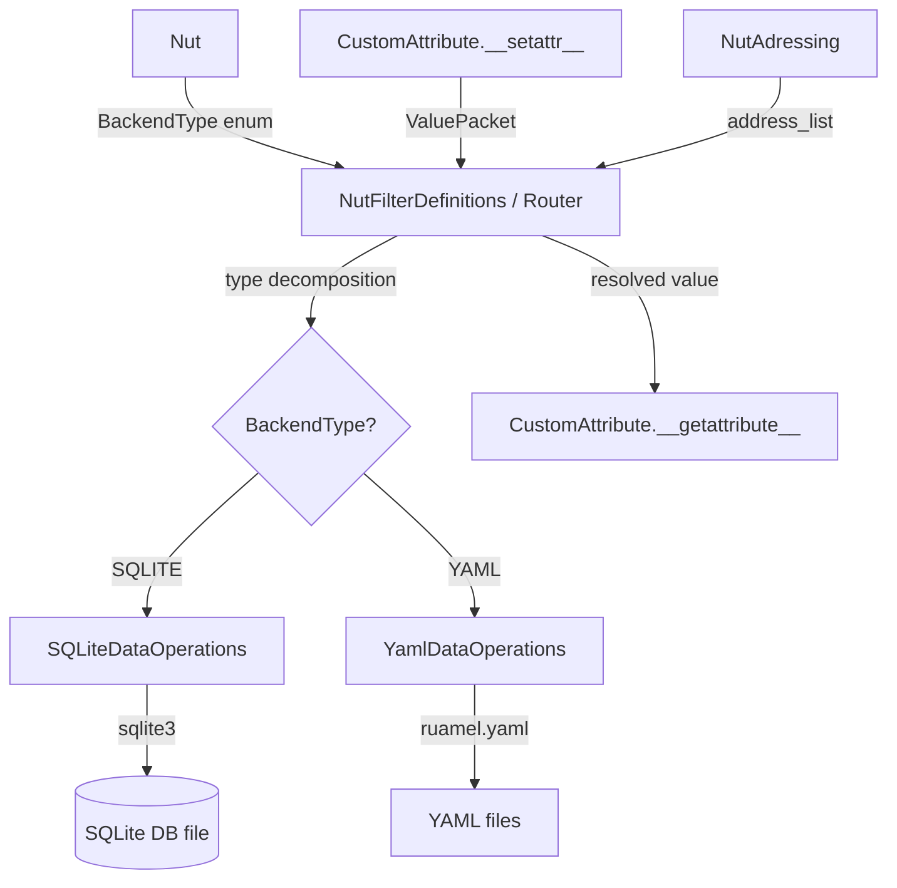
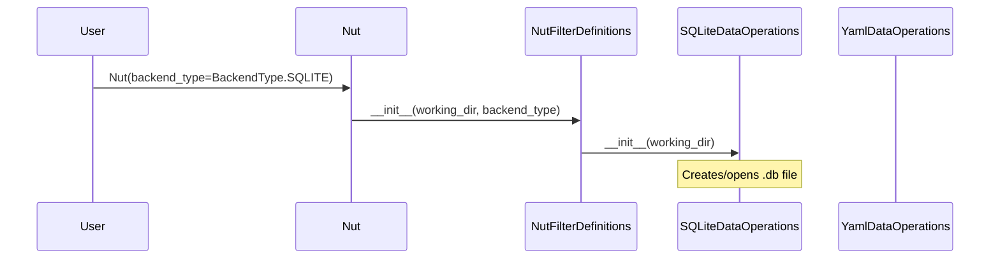

# Design Document: SQLite Routing Backend

## Overview

This design introduces an SQLite persistence backend (`SQLiteDataOperations`) as an alternative to the existing YAML-based storage (`YamlDataOperations`). The system uses a `BackendType` enum to select which backend is active at `Nut` initialization time. Both backends implement the same interface contract (`save_data` / `read_data`), making them interchangeable from the router's perspective.

The router (`NutFilterDefinitions`) continues to own all type decomposition and routing logic. The backend is intentionally "dumb I/O" — it receives pre-typed data objects (`String`, `Integer`, `FloatingPoint`, `Dictionary`, `ListOfThings`, or dataclass field sets) and persists them, or reads them back and returns the same typed objects.

Key design decisions:
- **No external dependencies** — uses Python's built-in `sqlite3` module
- **Single database file per Nut** — stored in the working folder
- **JSON serialization for complex types** — dicts and lists are stored as JSON with type metadata
- **Dataclass field decomposition** — dataclass instances are stored as individual field rows
- **Backward compatible** — existing YAML backend continues to work unchanged

## Architecture



### Data Flow

1. `CustomAttribute.__setattr__` creates a `ValuePacket` and calls `nut_filter.filter(flow_direction=OUTBOUND, ...)`
2. `NutFilterDefinitions.filter()` resolves the address via `NutAdressing`, then delegates to `filter_out_flow()`
3. `filter_out_flow()` decomposes the value into typed objects (`String`, `Integer`, etc.) and calls `ops.save_data()`
4. The active backend (`SQLiteDataOperations` or `YamlDataOperations`) persists the data
5. On read, the reverse path through `filter_in_flow()` → `ops.read_data()` reconstructs the typed value

### Backend Selection Flow



## Components and Interfaces

### BackendType Enum

```python
# src/data_squirrel/config/backend_types.py
from enum import Enum

class BackendType(Enum):
    YAML = "YAML"
    SQLITE = "SQLITE"
```

### DataOperations Protocol (Interface Contract)

Both backends must satisfy this interface. We use Python's `Protocol` (typing) to define the contract:

```python
from typing import Protocol, Any
from pathlib import Path

class DataOperationsProtocol(Protocol):
    def save_data(self, data: Any, working_folder: Path, nut_name: str, filename: Path) -> None:
        """Persist a typed data object (String, Integer, FloatingPoint, Dictionary, ListOfThings, or dataclass fields)."""
        ...

    def read_data(self, working_folder: Path, nut_name: str, filename: Path) -> Any:
        """Read and return a typed data object from storage."""
        ...
```

Note: The `filename` parameter semantics differ slightly between backends:
- **YamlDataOperations**: `filename` is the actual YAML file path
- **SQLiteDataOperations**: `filename` is used to derive the address key (the path components encode the address)

Both backends accept the same parameters from `NutFilterDefinitions`, maintaining the existing call sites unchanged.

### SQLiteDataOperations Class

```python
# src/data_squirrel/config/nut_sqlite_operations.py
import sqlite3
import json
from pathlib import Path
from typing import Any, Dict, List
from dataclasses import fields, asdict

from data_squirrel.config.nut_yaml_objects import (
    String, Integer, FloatingPoint, Dictionary, ListOfThings, NutObjectType
)

class SQLiteDataOperations:
    DB_FILENAME = "nut_data.db"

    def __init__(self, working_folder: Path) -> None:
        if not working_folder.exists():
            raise FileNotFoundError(f"Working folder does not exist: {working_folder}")
        self._db_path = working_folder / self.DB_FILENAME
        self._init_db()

    def save_data(self, data: Any, working_folder: Path, nut_name: str, filename: Path) -> None:
        """Persist typed data to SQLite."""
        ...

    def read_data(self, working_folder: Path, nut_name: str, filename: Path) -> Any:
        """Read typed data from SQLite."""
        ...
```

### Modified NutFilterDefinitions

```python
class NutFilterDefinitions:
    def __init__(self, working_dir: Path, backend_type: BackendType = BackendType.SQLITE) -> None:
        self.working_dir = working_dir
        self.backend_type = backend_type

        if backend_type == BackendType.YAML:
            self.operations = YamlDataOperations()
        elif backend_type == BackendType.SQLITE:
            self.operations = SQLiteDataOperations(working_folder=working_dir)
        else:
            raise ValueError(f"Unsupported backend type: {backend_type}")
```

### Modified Nut Class

```python
@define(kw_only=True)
class Nut:
    # ... existing fields ...
    backend_type: BackendType = field(default=BackendType.SQLITE)

    def __attrs_post_init__(self):
        self.nut_filter = NutFilterDefinitions(
            working_dir=self.working_folder,
            backend_type=self.backend_type
        )
        # ... rest unchanged ...
```

## Data Models

### SQLite Schema

A single table stores all values. The address path is serialized as the primary key.

```sql
CREATE TABLE IF NOT EXISTS nut_values (
    address_key TEXT PRIMARY KEY,
    value_type  TEXT NOT NULL,
    value_data  TEXT NOT NULL,
    nut_name    TEXT NOT NULL
);
```

Column definitions:
- **address_key**: The address list joined with a separator (e.g., `"attr_name|parent_name|nut_name"`). This mirrors the `AddressInfo.address_string` concept but uses a pipe separator to avoid filename constraints.
- **value_type**: One of `"STRING"`, `"INTEGER"`, `"FLOAT"`, `"DICTIONARY"`, `"LIST"`, `"DATACLASS"`.
- **value_data**: JSON-encoded payload containing the value and any type metadata.
- **nut_name**: The nut name from the address list (for potential future queries).

### Serialization Format (value_data JSON)

**Primitives:**
```json
{"value": "hello"}
{"value": 42}
{"value": 3.14}
```

**Dictionary:**
```json
{
  "key_def": "STRING",
  "value_def": "INTEGER",
  "value": {"apple": 1, "banana": 2}
}
```

**List:**
```json
{
  "value_def": "STRING",
  "value": ["a", "b", "c"]
}
```

**Dataclass:**
```json
{
  "module": "my_module",
  "attribute": "MyDataclass",
  "fields": {
    "name": {"type": "STRING", "value": "test"},
    "count": {"type": "INTEGER", "value": 5}
  }
}
```

### Address Key Derivation

The address key is derived from the same `address_list` that `NutAdressing.get_attr_address()` produces. The list is joined with `"|"` as separator:

```python
def _make_address_key(self, address_list: List[str]) -> str:
    return "|".join(address_list)
```

This is extracted from the `filename` parameter (which encodes the address path) to maintain interface compatibility with `YamlDataOperations`.

### Type Mapping

| Python Type | value_type | NutObjectType | Serialization |
|---|---|---|---|
| `str` | `"STRING"` | `NutObjectType.STRING` | Direct JSON string |
| `int` | `"INTEGER"` | `NutObjectType.INTEGER` | Direct JSON number |
| `float` | `"FLOAT"` | `NutObjectType.FLOATINGPOINT` | Direct JSON number |
| `dict` | `"DICTIONARY"` | N/A | JSON with key_def/value_def metadata |
| `list` | `"LIST"` | N/A | JSON with value_def metadata |
| dataclass | `"DATACLASS"` | `NutObjectType.CLASS` | JSON with module/attribute/fields |

## Correctness Properties

*A property is a characteristic or behavior that should hold true across all valid executions of a system — essentially, a formal statement about what the system should do. Properties serve as the bridge between human-readable specifications and machine-verifiable correctness guarantees.*

### Property 1: Primitive Value Round-Trip

*For any* supported primitive value (str, int, or float) and any valid address list, storing the value via `save_data` and then retrieving it via `read_data` at the same address SHALL produce a value that is equal to the original AND has the same Python type (i.e., `type(result) == type(original)` and `result == original`).

**Validates: Requirements 2.1, 2.2, 2.3, 3.1, 3.2, 3.3, 6.1, 6.4, 11.29, 11.30, 11.31**

### Property 2: Dictionary Round-Trip

*For any* dictionary with supported key types (str, int, float) and supported value types (str, int, float, list), storing the dictionary via `save_data` and then retrieving it via `read_data` at the same address SHALL produce a dictionary equal to the original with correctly typed keys and values.

**Validates: Requirements 2.4, 3.4, 6.2, 11.32**

### Property 3: List Round-Trip

*For any* list with supported item types (str, int, float), storing the list via `save_data` and then retrieving it via `read_data` at the same address SHALL produce a list equal to the original with correctly typed items.

**Validates: Requirements 2.5, 3.5, 6.3, 11.33**

### Property 4: Dataclass Round-Trip

*For any* registered dataclass instance with fields of supported primitive types (str, int, float), storing the instance via `save_data` and then retrieving it via `read_data` at the same address SHALL produce an instance equal to the original.

**Validates: Requirements 9.1, 9.2, 9.7, 11.34**

### Property 5: Overwrite Semantics (Last Write Wins)

*For any* address and any two distinct values of supported types, storing the first value and then storing a second value at the same address SHALL result in `read_data` returning only the second value.

**Validates: Requirements 4.3**

### Property 6: Address List Acceptance

*For any* valid address list (a non-empty list of non-empty strings), the SQLite backend SHALL accept it as a storage key and successfully store and retrieve a value without transformation or error.

**Validates: Requirements 4.1, 7.3**

### Property 7: Backend Equivalence

*For any* supported primitive value (str, int, float), storing and retrieving via `SQLiteDataOperations` SHALL produce the same result as storing and retrieving via `YamlDataOperations` at an equivalent address.

**Validates: Requirements 10.7**

## Error Handling

| Condition | Error Type | Message Pattern |
|---|---|---|
| Working folder doesn't exist | `FileNotFoundError` | `"Working folder does not exist: {path}"` |
| Unsupported value type (non-None) | `ValueError` | `"Unsupported value type: {type}. Please update and try again."` |
| Read at non-existent address | `KeyError` | `"No value stored at address: {address_key}"` |
| Unregistered dataclass type | `TypeError` | `"Dataclass type {type} is not registered in external_imports"` |
| Unsupported BackendType | `ValueError` | `"Unsupported backend type: {backend_type}"` |
| Database write failure | `sqlite3.Error` (re-raised) | Original SQLite error message |

### Error Handling Strategy

- **Fail fast**: Validate inputs at the boundary (in `save_data`/`read_data`) before touching the database.
- **Atomic writes**: Each `save_data` call uses `INSERT OR REPLACE` within an implicit transaction. If it fails, the previous state is preserved.
- **No silent failures**: Every error condition raises an exception. No data is silently dropped.
- **Descriptive messages**: All error messages include the relevant context (path, type, address) for debugging.

## Testing Strategy

### Testing Framework

- **Unit/Integration tests**: `pytest`
- **Property-based tests**: `hypothesis` library
- **Minimum iterations**: 100 per property test (Hypothesis default is higher, which is fine)

### Test Organization

```
src/test/
├── test_sqlite_operations.py       # Unit tests for SQLiteDataOperations
├── test_sqlite_routing.py          # Integration tests for full routing pipeline
├── test_backend_switching.py       # BackendType enum switching tests
├── test_sqlite_properties.py       # Property-based tests (Hypothesis)
└── test_sqlite_edge_cases.py       # Edge case tests
```

### Unit Tests

- Verify database initialization (file created, table exists)
- Verify save/read for each primitive type (str, int, float)
- Verify save/read for dict with type metadata
- Verify save/read for list with type metadata
- Verify save/read for dataclass instances
- Verify error conditions (missing folder, missing address, unsupported type)

### Integration Tests

- Full pipeline: `CustomAttribute.__setattr__` → router → SQLite → read back
- Backend switching: same operations produce same results with YAML and SQLite
- Multiple attributes on same Nut stored at distinct addresses

### Property-Based Tests (Hypothesis)

Each correctness property maps to a single Hypothesis test:

| Property | Hypothesis Strategy | Tag |
|---|---|---|
| Property 1: Primitive Round-Trip | `one_of(text(), integers(), floats(allow_nan=False, allow_infinity=False))` | `Feature: sqlite-routing, Property 1: Primitive value round-trip` |
| Property 2: Dictionary Round-Trip | `dictionaries(keys=one_of(text(), integers()), values=one_of(text(), integers(), floats(allow_nan=False)))` | `Feature: sqlite-routing, Property 2: Dictionary round-trip` |
| Property 3: List Round-Trip | `lists(one_of(text(), integers(), floats(allow_nan=False, allow_infinity=False)))` | `Feature: sqlite-routing, Property 3: List round-trip` |
| Property 4: Dataclass Round-Trip | Custom strategy generating dataclass instances with primitive fields | `Feature: sqlite-routing, Property 4: Dataclass round-trip` |
| Property 5: Overwrite Semantics | Two values of same type + random address | `Feature: sqlite-routing, Property 5: Overwrite semantics` |
| Property 6: Address List Acceptance | `lists(text(min_size=1, alphabet=characters(whitelist_categories=('L', 'N'))), min_size=1)` | `Feature: sqlite-routing, Property 6: Address list acceptance` |
| Property 7: Backend Equivalence | `one_of(text(), integers(), floats(allow_nan=False, allow_infinity=False))` | `Feature: sqlite-routing, Property 7: Backend equivalence` |

### Edge Case Tests

- Empty dictionary round-trip
- Empty list round-trip
- None value handling (graceful, no crash)
- Overwrite at same address
- Unicode and special characters in strings
- Very large integers
- Read from non-existent address
- Unsupported type raises ValueError

### Test Configuration

```python
from hypothesis import settings

# All property tests use at least 100 examples
@settings(max_examples=200)
```

### Dependency Note

The `hypothesis` library must be added as a test dependency. It is the standard property-based testing library for Python and integrates directly with pytest.
